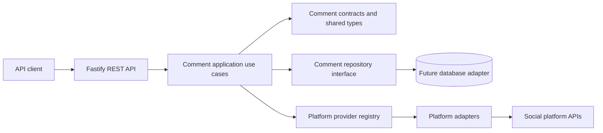

# Architecture

## Context

The service sits inside a social media scheduling platform that already supports multiple social platforms and will add more. The comment feature therefore needs a stable application contract without pretending that every provider has identical capabilities.

## High-level architecture

The initial target is a modular monolith with four logical layers:

The diagram describes boundaries, not an implementation commitment. At this stage only the contracts and placeholders exist.

## Dependency direction

- `api` depends on application contracts and maps HTTP concerns.
- `comments` owns use-case contracts and domain-facing types.
- `platforms` implements provider-facing contracts and hides SDK/API details.
- Persistence adapters implement repository interfaces and remain replaceable.
- `shared` contains small cross-cutting types and primitives; it must not become a dumping ground.

Dependencies point toward stable contracts. Fastify, a database client, and provider SDKs should not leak into the domain model.

## Platform abstraction

The application should select a provider through a registry keyed by platform. Each adapter translates provider-specific identifiers, pagination, errors, timestamps, and capabilities into the service contract. Provider-specific features should be exposed deliberately rather than by weakening the common interface.

The first implementation should establish a capability matrix before adding adapters. A provider that cannot support a requested operation should return a typed, actionable unsupported-capability error.

## Future extensibility

Adding a platform should normally require:

1. A provider adapter implementing the existing contract.
2. Provider configuration and credential wiring.
3. Mapping and contract tests for provider behavior.
4. Documentation of capability differences and operational limits.

Adding a platform should not require changing route semantics or domain persistence unless the common model is genuinely insufficient. This keeps the cost of future integrations local.

## Deliberate non-goals

The initial design does not introduce microservices, CQRS, event sourcing, Kafka, or a full domain-driven design ceremony. A modular monolith is sufficient until scale, team topology, or operational constraints demonstrate otherwise.
