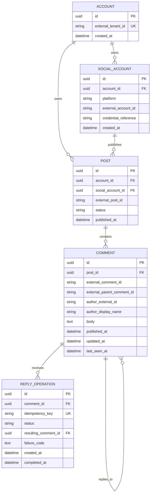

# Database design

The database is intentionally not implemented in the initialization milestone. The following normalized model gives the future repository layer a concrete target while leaving the storage technology open.

## Design goals

- Preserve stable internal identifiers while retaining provider identifiers.
- Make comments queryable by internal post and platform.
- Support deduplication when the same provider comment is observed repeatedly.
- Record reply attempts and idempotency keys for safe client retries.
- Keep credentials and access tokens outside this schema.

## Initial entities

### Account

Represents the existing platform tenant or account that owns connected social accounts.

### Social account

Represents one authorized connection to a provider. It stores provider identity and references credentials managed by existing infrastructure.

### Post

Represents a scheduled/published post in the host platform. It maps to a provider-specific post identifier.

### Comment

Stores a normalized snapshot of a provider comment, including its external identity, author information, parent relationship, and timestamps.

### Reply operation

Records a client-requested reply and its idempotency key. It supports auditability and safe retry handling without making the operation itself the source of truth for the external comment.

## Mermaid ERD

## Constraints to validate during implementation

- Unique provider identity within a provider scope, such as `(social_account_id, external_comment_id)`.
- Unique idempotency key within the authenticated account scope.
- Index comments by `(post_id, published_at, id)` for deterministic cursor queries.
- Define deletion and retention behavior before production use.
- Treat provider payloads and raw error details as sensitive operational data.
