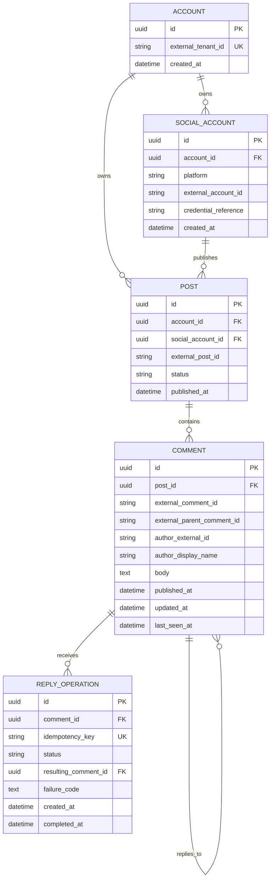

# Database design

The repository boundary is implemented with a deterministic in-memory adapter for local tests, and the production target is PostgreSQL 16+ using `migrations/001_initial_schema.sql`. Application code remains independent of the database client.

## Design goals

- Preserve stable internal identifiers while retaining provider identifiers.
- Make comments queryable by internal post and platform.
- Support deduplication when the same provider comment is observed repeatedly.
- Record reply attempts and idempotency keys for safe client retries.
- Keep credentials and access tokens outside this schema.

## Initial entities

### Account

Represents the existing platform tenant or account that owns connected social accounts.

### Social account

Represents one authorized connection to a provider. It stores provider identity and references credentials managed by existing infrastructure.

### Post

Represents a scheduled/published post in the host platform. It maps to a provider-specific post identifier.

### Comment

Stores a normalized snapshot of a provider comment, including its external identity, author information, parent relationship, and timestamps.

### Reply operation

Records a client-requested reply and its idempotency key. It supports auditability and safe retry handling without making the operation itself the source of truth for the external comment.

## Mermaid ERD

## Snapshot completeness

`posts` carries `provider_cursor` and `provider_exhausted` (Spec-013). Together they record how much of a post's provider comment stream has been read into the local snapshot: the continuation for the next unfetched page, and whether the end has been reached.

Without them the service could not distinguish an exhausted provider from one it had never asked, because that knowledge lived only inside a cursor handed to one client. A caller starting pagination fresh was then told a post held fewer comments than it did.

The service is granted `update` on just these two columns; everything else about a post remains read-only to it.

## Constraints to validate during implementation

- Treat `account_id` as the tenant boundary for all account-owned entities and scope every query to it.
- Prefer database row-level security when supported; policies must fail closed without trusted tenant context and be tested across at least two tenants.
- Unique provider identity within a provider scope, such as `(social_account_id, external_comment_id)`.
- Unique idempotency key within the authenticated account scope.
- Index comments by `(post_id, published_at, id)` for deterministic cursor queries.
- Index the referencing side of every foreign key that is looked up or cascaded through. PostgreSQL indexes only the referenced side.
- Constrain `platform` at the database, not only in the validator: the column is the shared fact and the validator is one code path.
- Define deletion and retention behavior before production use. Migration `006` fixes the referential half of it (see below); automated retention remains open.
- Treat provider payloads and raw error details as sensitive operational data.

## Tenant context and RLS

The application sets the transaction-local `app.account_id` value from trusted authentication context before querying tenant-owned tables, which the `Database` port does for every operation (ADR-0012). Policies fail closed when the value is absent. Repository predicates remain mandatory defence in depth.

Isolation depends on **which role connects**, not only on the policies existing:

- `comments_owner` owns the schema and runs migrations and the seed.
- `comments_app` runs the service. It owns nothing and is not a superuser, so the policies apply to it.

PostgreSQL exempts superusers and `BYPASSRLS` roles from row-level security unconditionally, and exempts a table's owner unless `FORCE ROW LEVEL SECURITY` is set. Migration `002` sets `FORCE` on the four tenant tables and creates `comments_app`. `FORCE` alone is not sufficient against a superuser owner, which is why the role separation is the primary control and `FORCE` is the safeguard for managed environments where the owner is not a superuser.

Migration `006` closes the two gaps that were left (Spec-018). `comments_app` had its attributes set only at creation, so a role of that name that already existed with `SUPERUSER` or `BYPASSRLS` defeated every policy while the migration reported success; the attributes are now pinned unconditionally on every run. And `accounts` — the one table `comments_app` could read without a policy — now carries one keyed on its own identifier.

Policy behaviour is verified against a real database across two tenants in `tests/repositories/postgres.integration.test.ts`, including a query with its `account_id` predicate deliberately removed, now covering `comments`, `posts`, `social_accounts`, `reply_operations`, and `accounts`. That case is what distinguishes working row-level security from repository predicates that merely resemble isolation. A separate test reads `pg_roles` and fails if the service role has drifted.

## Deletion semantics

Every foreign key states its `ON DELETE` behaviour as of migration `006`. Before that they carried PostgreSQL's default, which meant deletion behaviour was whatever the default happened to be rather than a decision anyone made.

The rule: **deleting a tenant removes everything that tenant owns, and within a tenant a post owns its comments — but the record of something published under a customer's name does not disappear quietly.**

| Foreign key                                      | On delete   | Why                                                               |
| ------------------------------------------------ | ----------- | ----------------------------------------------------------------- |
| every `account_id`                               | `cascade`   | Deleting a tenant is a whole-tenant operation.                    |
| `posts.social_account_id`                        | `cascade`   | A post has no meaning without the connection it went out through. |
| `comments.post_id`, `comments.social_account_id` | `cascade`   | A comment is a snapshot of that post's conversation.              |
| `reply_operations.comment_id`                    | `no action` | The row records a publication under a customer's name.            |
| `reply_operations.resulting_comment_id`          | `no action` | As above.                                                         |

`reply_operations` uses `NO ACTION` rather than `RESTRICT` deliberately. Both refuse to let a comment be deleted while an operation references it; they differ in when the check runs. `RESTRICT` fires immediately and would make deleting a whole account impossible, because that account's cascade removes the operations and the comments in the same statement. `NO ACTION` defers to the end of the statement, by which point the operations are already gone. Deleting one comment with a reply behind it fails; deleting a tenant succeeds.

Automated retention — how long a snapshot or an audit row is kept — remains an open operational decision recorded in [operations.md](operations.md).
